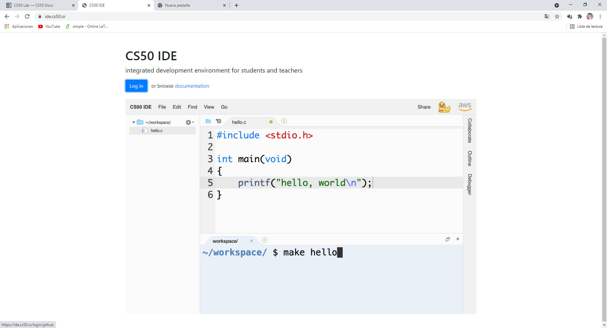
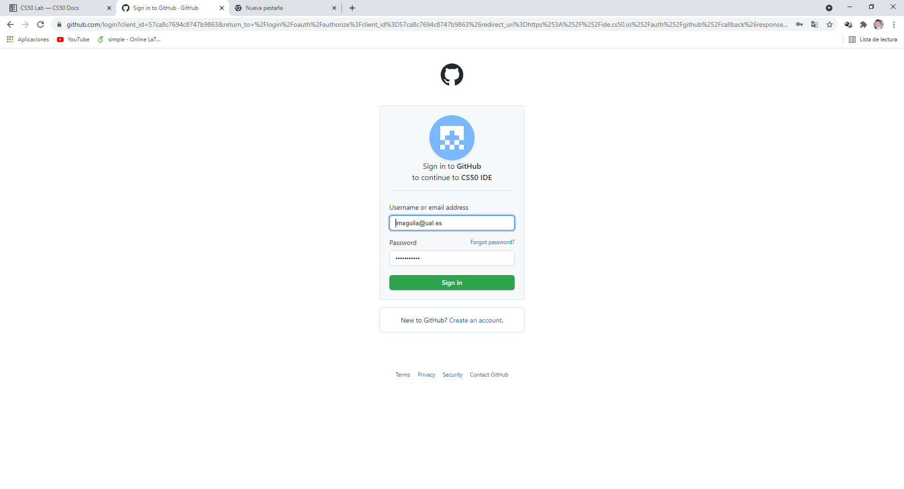

# Configuración del entorno de trabajo

## Creación de cuentas de github

Crear la cuenta de github



Utiliza la cuenta de la ual como alumno





## Conectar con el IDE

debemos entrar en









