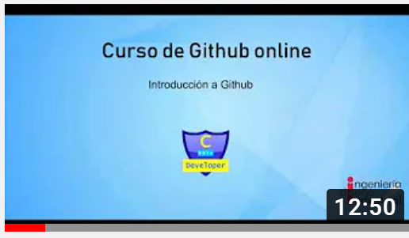
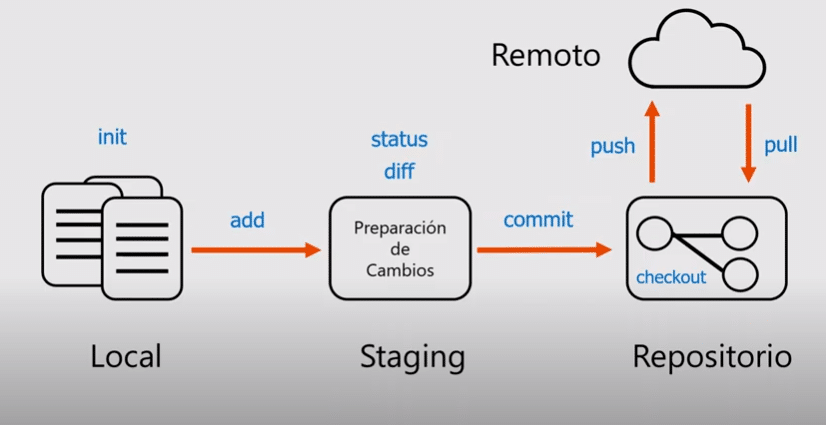
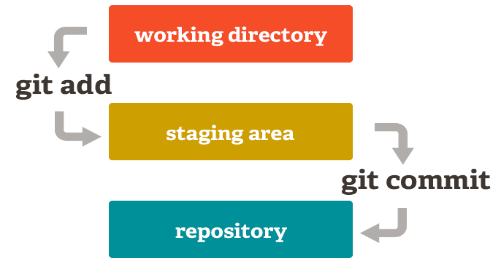
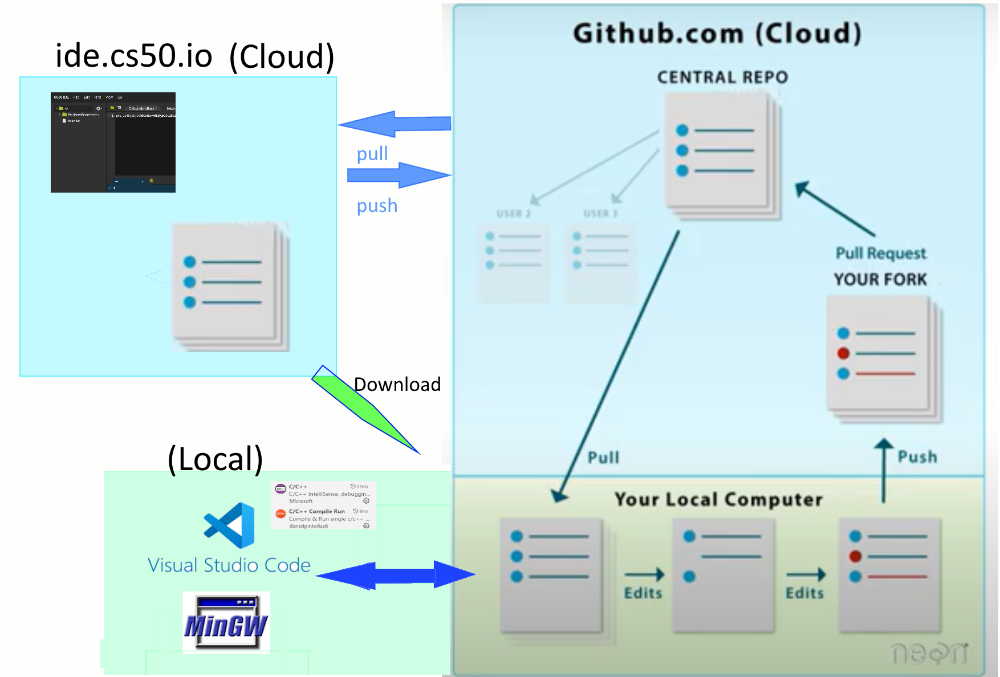
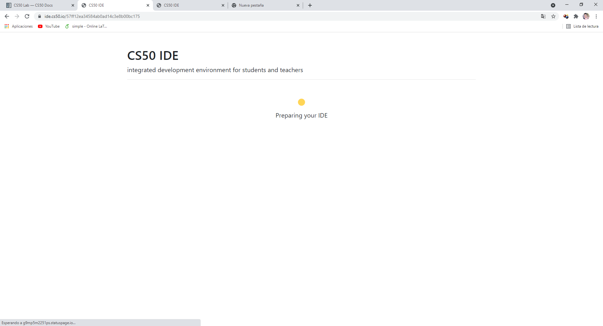
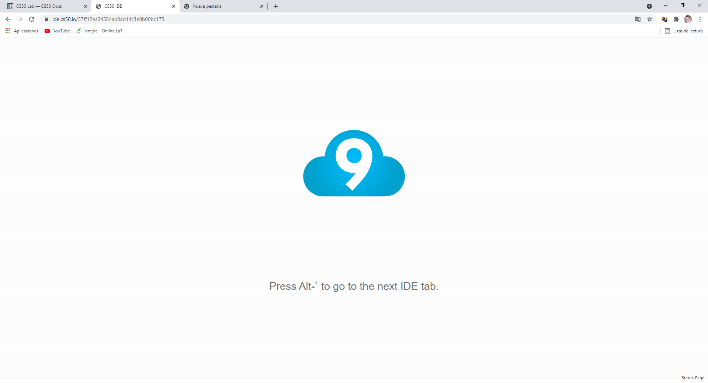

# Configuración del entorno de trabajo

En esta asígnatura se **aprenderá a programar**, pero además trabajaremos de forma cooperativa para desarrollar todos los ejercicios de las prácticas.

Este **trabajo en equipo** se fundamentará en compartir el trabajo realizado a través del uso de repositorios compartidos de código.

La plataforma que se utilizará es **GitHub** que permite alojar proyectos utilizando el sistema de control de versiones Git para la creación de código fuente de programas de ordenador.

Lo primero por tanto será crear una cuenta en www.gihub.com

## Creación de cuentas de github

Crear la cuenta de github utilizando el boton **Sing up** en la esquina superior derecha de la página www.github.com. Se debe utilizar la cuenta institucional de la universidad de Almería (.inlumine.es) para el registro de la cuenta.

En caso de dudas en el proceso se puede consultar los trabajos del proyecto aigora (Universidad Politécnica de Madrid). [Aigora](https://github.com/MaterialesProgramacion/punto_inicio).

Los repositorios local y remoto se deben sincronizar utilizando diversos comandos git que se muestran a continuación.

- *git init* - convierte la carpeta en un directorio git, es decir define las tres áreas de trabajo que permiten controlar las versiones de un proyecto. 
     
- *git add* - Añade archivos a la staged área, es decir los habilita como una versión a dar por definitiva
- *git commit* - Hace definitiva los archivos previamente añadidos. Es necesario incluir un mensaje 
- *git pull*  y  *git push* son los dos comandos que permiten sincronizar el escritorio remoto.

## Creación de tokens personales para acceso y asignación a Organización

## Entornos de desarrollo integrado IDE

Es posible trabajar con diversas configuraciones diferentes IDE, bien con uso totalmente integrado en la nube o en un entorno local que implica la instalación y control del código local, sobre la computadora en la que se está trabajando.

El esquema mostrado a continuación muestra ambas posibilidades. Cabe decir que si bien el para la versión "online" el uso de Github es solo necesario para la identificación, es recomendable, para tener doble copia del trabajo, o bien hacer descargas locales.

### Uso de un entorno local

En esta arquitectura tenemos mas "controlado" el código, pero es necesario realizar la instalación de un conjunto de herramientas adicionales

- Compilador de C, por ejemplo MinGW o cualquier otro
- Visual Studio Code
- Extensiones de Visual Studio Code para C
- Es necesario la utilzación de la nube (Github) para compartir el código.

El siguiente video muestra como trabajar en modo local.

https://www.youtube.com/watch?v=qQT-6WufAEE

### Uso de un entorno online en la nube

Se basa en la utilización directa de la nube, no es necesario instalar nada local y la colaboración se hace directamente sobre la nube, compartiendo el área de trabajo. Tiene el inconvieniente de la falta de control y de la posible "desconexión" en un momento dado.

Requisitos: Una cuenta en github para facilitar el acceso a los entornos online donde también existen dos opciones

- IDE CS50: ide.cs50.io. 
- Visual Studio online: code.cs50.io 

Si bien no es necesario para programar si que será obligatorio para ser evaluados en la asignatura subir el trabajo a GitHub, siendo también recomendable descargarlo de forma local en un archivo comprimido, para mantener una copia local del trabajo. 

## Conectar con el IDE

### Entrar en IDE CS50 

 Se debe entrar en el enlace ide.cs50.io. y a partir de aquí se muestran la sucesión de pantallas mostradas a continuación tras pulsar al login, pero si se está en GitHub no pedirá la autentificación.

Ya tenemos acceso al entorno y se puede empezar a trabajar 

### Entrar en Visual Studio Code online

code.cs50.io

### Push pull

https://techglimpse.com/git-push-github-token-based-passwordless/

